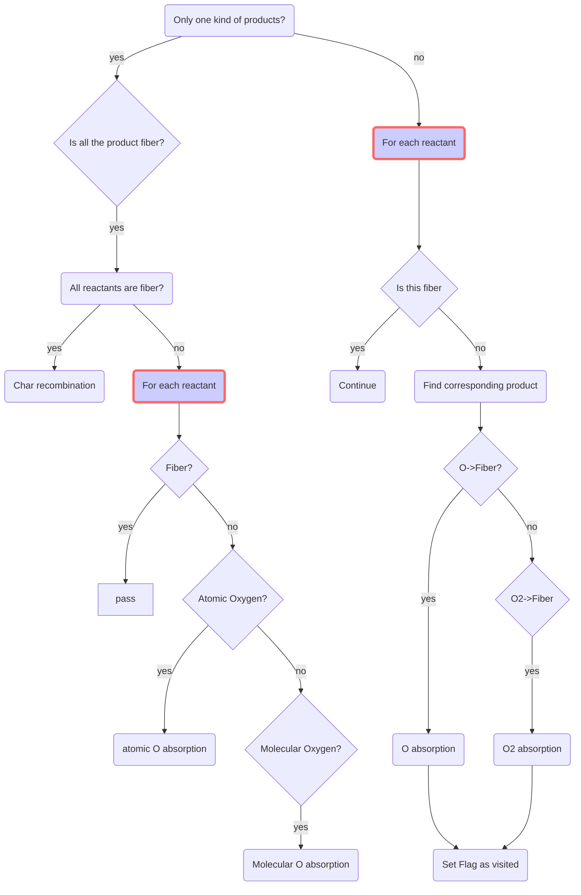

```mermaid
graph TD;
A(Only one kind of products?)
B{Is all the product fiber?}
A-->|yes|B
C(All reactants are fiber?)
B-->|yes|C
D(Char recombination)
C-->|yes|D
E(For each reactant)
style E fill:#ccf,stroke:#f66,stroke-width:4px
C-->|no|E
F{Fiber?}
E-->F
G[pass]
F-->|yes|G
H{Atomic Oxygen?}
F-->|no|H
I(atomic O absorption)
H-->|yes|I
J{Molecular Oxygen?}
H-->|no|J
K(Molecular O absorption)
J-->|yes|K
L(For each reactant)
style L fill:#ccf,stroke:#f66,stroke-width:4px
A-->|no|L
M{Is this fiber}
L-->M
M-->|yes|N
N(Continue)
M-->|no|O
O(Find corresponding product)
P{O->Fiber?}
O-->P
Q(O absorption)
P-->|yes|Q
R(Set Flag as visited)
Q-->R
S{O2->Fiber}
P-->|no|S
T(O2 absorption)
S-->|yes|T
T-->R
```
