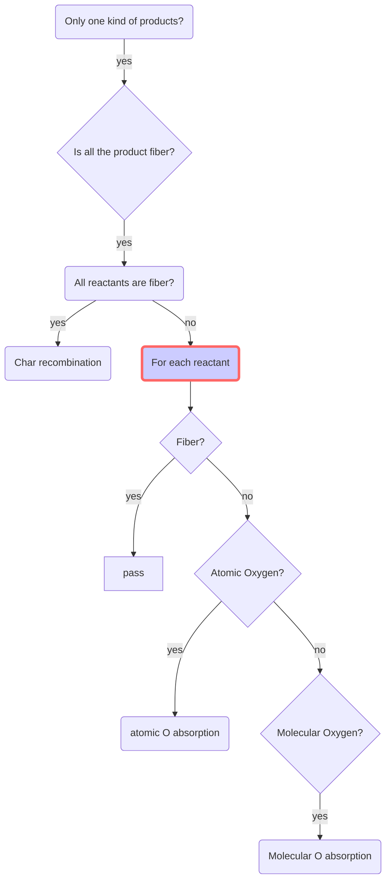

```mermaid
graph TD;
A(Only one kind of products?)
B{Is all the product fiber?}
A-->|yes|B
C(All reactants are fiber?)
B-->|yes|C
D(Char recombination)
C-->|yes|D
E(For each reactant)
style E fill:#ccf,stroke:#f66,stroke-width:4px
C-->|no|E
F{Fiber?}
E-->F
G[pass]
F-->|yes|G
H{Atomic Oxygen?}
F-->|no|H
I(atomic O absorption)
H-->|yes|I
J{Molecular Oxygen?}
H-->|no|J
K(Molecular O absorption)
J-->|yes|K
```
